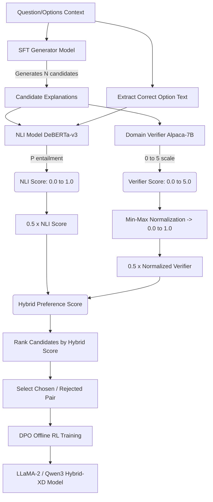
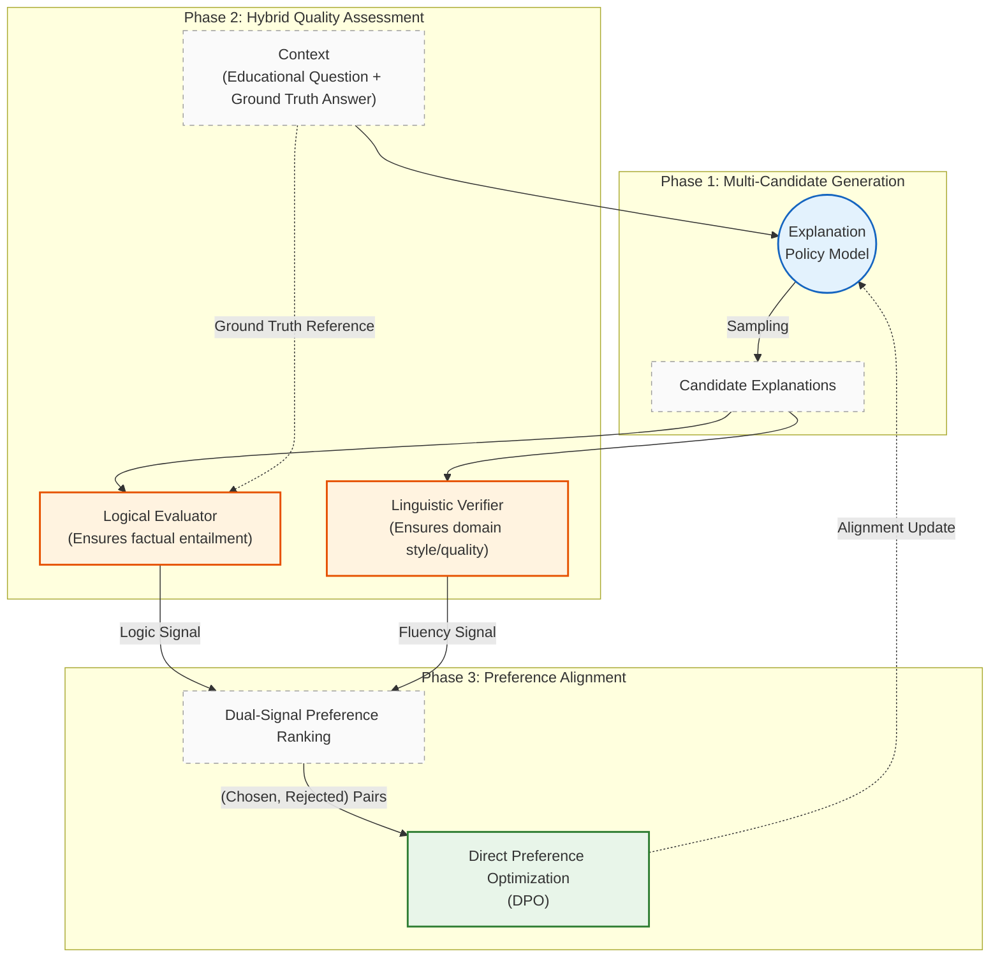

# RLearner-LLM: Reinforcement Learning for Educational Explanation Generation

> **Extension of ILearner-LLM** — replaces K-round iterative inference with RL-trained single-pass generation.
> See the main [README.md](README.md) for the full project overview.

---

## Table of Contents
- [Three Paper Innovations](#three-paper-innovations)
- [System Architecture](#system-architecture)
- [Training Pipeline](#training-pipeline)
- [Experimental Results](#experimental-results)
  - [Cardiff Biology](#cardiff-biology-dataset)
  - [Sydney Biology](#sydney-biology-dataset)
  - [Cross-Domain Generalization](#cross-domain-generalization-results)
  - [GPT Model Comparison](#gpt-model-comparison)
  - [GPT Pairwise Judge Results](#gpt-pairwise-judge-results)
  - [ILearner-LLM K=5 Baseline](#ilearner-llm-k5-baseline)
  - [LLaMA-3-8B Experiments](#llama-3-8b-experiments)
  - [NLI-Guided PPO Results](#nli-guided-ppo-results)
  - [Large NLI Calibration Study](#large-nli-calibration-study)
  - [Latency Profiling](#latency-profiling)
  - [Qwen3 Thinking Mode](#qwen3-thinking-mode)
  - [Qwen3 4-bit Quantization](#qwen3-4-bit-quantization)
- [Key Conclusions](#key-conclusions)
- [Future Work](#future-work)
- [Reproducing Results](#reproducing-results)

---

## Three Paper Innovations

### Innovation 1 — Single-Pass RL Generation Replacing Iterative Inference

**Problem**: The original ILearner-LLM pipeline runs K sequential rounds of Generator → Verifier → Feedback, where latency scales linearly with K. At K=5, inference is 5× slower than a single-pass model, making real-time deployment impractical.

**Our Approach**: Instead of iterating at test time, we embed the Generator–Verifier interaction into the training signal itself. Using the verifier as a reward model, we apply:
- **DPO (Direct Preference Optimization)** — offline RL from verifier-ranked candidate pairs.
- **PPO (Proximal Policy Optimization)** — online RL with live verifier reward signals.

**Result**: At inference time, a single forward pass produces explanations that match or exceed the quality of K=5 iterative refinement, at **~3.4× lower latency** (5.8s vs 19.9s per question for SFT).

| Approach | Inference passes | Avg latency (Cardiff) |
|----------|-----------------|----------------------|
| SFT baseline (LoRA) | 1 | 19.9s |
| **DPO v2 (ours)** | **1** | **5.8s** |
| PPO (ours) | 1 | 7.2s |
| GPT-4o-mini (API) | 1 (API) | 5.6s |
| Qwen3-8B SFT | 1 | 4.0s |

---

### Innovation 2 — Answer-Grounded Multi-Metric Evaluation Framework

**Problem**: Standard text-generation metrics (BLEU, BERTScore vs. student explanation) measure surface similarity to reference text. For explanation quality, what matters most is whether the explanation correctly identifies and justifies the *correct answer option* — which BLEU/BERTScore fail to capture when comparing against student-written reference text.

**Our Approach**: We propose a three-tier answer-grounded evaluation framework, where the hypothesis for each metric is the *correct answer option text* (not the student reference):

| Metric | What it measures | Hypothesis |
|--------|-----------------|------------|
| **BERT(Ans)** | Semantic similarity to correct option | Correct option text |
| **ACR** (Answer Coverage Rate) | Lexical coverage of key terms from correct option | ≥4-char tokens from correct option |
| **NLI Entailment** | Logical entailment: does explanation *imply* correct option? | Correct option text |

The NLI metric (using `cross-encoder/nli-deberta-v3-small`) is the most discriminative: **SFT scores ~0.05** while **all RL models score 0.22–0.30** (4–5× gap), directly capturing whether explanations logically support the correct answer.

**Key finding on GPT models**: GPT-4 achieves the highest BERTScore(Stu) but only NLI=0.07 on Cardiff — worse than our SFT baseline. This reveals that high fluency does not imply answer-grounded reasoning. GPT-3.5, by contrast, achieves NLI=0.27 — comparable to our best RL model — suggesting smaller GPT models may follow task instructions more literally.

---

### Innovation 3 — Automated Verifier-Based Preference Data Construction

**Problem**: DPO requires high-quality preference pairs (chosen/rejected). Human annotation is expensive and slow. Using a fixed GPT-4 teacher creates domain mismatch for biology/medicine exam questions.

**Our Approach**: We automatically construct preference pairs using the domain-trained verifier model itself as the preference oracle:

1. **Multi-sample generation**: For each question, generate N candidate explanations (N=3) using the SFT model.
2. **Verifier scoring**: Score all N candidates with the domain verifier (0–5 scale).
3. **Pair selection**: Select `(highest-scored, lowest-scored)` if score gap ≥ threshold (0.1).
4. **Iterative scaling**: Increase N and lower the threshold to get more pairs.

| Version | Questions | Samples/Q | Min gap | Pairs | Training epochs | Result |
|---------|-----------|-----------|---------|-------|-----------------|--------|
| Pref v1 | 500 | 2 | 0.3 | **165** | 2 | DPO v1 |
| Pref v2 | 500 | 3 | 0.1 | **458** (+2.77×) | 5 | DPO v2 (best) |
| Pref v3 | 1000 | 3 | 0.1 | **851** | 5 | DPO v3 (cross-domain) |

**Key advantage**: The verifier is domain-specific, trained on Cardiff+Sydney+Law+Medicine data, making preference pairs highly relevant to the target distribution. No API cost, no domain mismatch.

---

## System Architecture

```
┌─────────────────── Training Pipeline ───────────────────────┐
│                                                              │
│  Phase 1 — SFT (Supervised Fine-Tuning)                     │
│  ─────────────────────────────────────                       │
│  13,211 expert explanations                                  │
│  + LLaMA-2-13B base model                                   │
│  + LoRA (r=16, α=32) fine-tuning                            │
│  ──────────────────────────────────►  SFT Generator         │
│                                                              │
│  Phase 2 — Preference Data Construction                      │
│  ──────────────────────────────────                          │
│  SFT Generator generates N explanations per question         │
│  Domain Verifier scores each candidate (0-5)                 │
│  ──────────────────────────────────►  (chosen, rejected) pairs│
│                                                              │
│  Phase 3A — DPO Training (Recommended)                       │
│  ─────────────────────────────────                           │
│  Preference pairs + SFT init                                 │
│  ──────────────────────────────────►  DPO Generator         │
│                                                              │
│  Phase 3B — PPO Training (Alternative)                       │
│  ─────────────────────────────────                           │
│  Online reward from verifier                                 │
│  ──────────────────────────────────►  PPO Generator         │
│                                                              │
└──────────────────────────────────────────────────────────────┘

┌─────────────────── Inference (1-shot) ───────────────────────┐
│                                                              │
│  Question + Options + Correct Answer                         │
│              │                                               │
│              ▼                                               │
│    ┌─────────────────┐                                       │
│    │  RL Generator   │  (single forward pass, ~6s)           │
│    │  (LoRA adapter) │                                       │
│    └─────────────────┘                                       │
│              │                                               │
│              ▼                                               │
│    High-quality explanation that names and justifies         │
│    the correct answer concept                                │
│                                                              │
└──────────────────────────────────────────────────────────────┘
```

---

## Training Pipeline

### Environments

| Env | Use | Key packages |
|-----|-----|-------------|
| `llm-tuning` | LLaMA-2-13B SFT / DPO / PPO | TRL 0.7.1, Transformers 4.31.0, PEFT 0.4.0 |
| `qwen3-rl` | Qwen3-8B all experiments | TRL 0.28, Transformers 5.2, torch 2.6.0+cu124 |

### Completed Training Runs

#### LLaMA-2-13B Experiments

| Step | Script | Config | Duration | Output |
|------|--------|--------|----------|--------|
| SFT | `rl_train_sft.py` | LLaMA-2-13B, LoRA r=16, 3 epochs, 13211 ex | 48 min, 4×A100 | `./rl_sft_llama2_13b_generator/` |
| Pref v1 | `rl_build_preference_data.py` | 500Q × 2 samples, gap≥0.3 | ~2h | 165 pairs |
| DPO v1 | `rl_train_dpo.py` | 165 pairs, 2 epochs | 68 sec | `./rl_dpo_llama2_13b_generator/` |
| Pref v2 | `rl_build_preference_data.py` | 500Q × 3 samples, gap≥0.1 | ~4h | 458 pairs |
| DPO v2 | `rl_train_dpo.py` | 458 pairs, 5 epochs | 14m52s | `./rl_dpo_v2_llama2_13b_generator/` |
| PPO | `rl_train_ppo.py` | 500Q, batch=4, 125 steps | ~3h | `./rl_ppo_llama2_13b_generator/` |
| Pref v3 | `rl_build_preference_data.py` | 1000Q × 3 samples, gap≥0.1 | ~6h | 851 pairs |
| DPO v3 | `rl_train_dpo.py` | 851 pairs, 5 epochs, all-domain data | ~30min | `./rl_dpo_v3_llama2_13b_generator/` |

#### Qwen3-8B Experiments

| Step | Script | Config | Duration | Output |
|------|--------|--------|----------|--------|
| SFT | `rl_train_sft_qwen3.py` | Qwen3-8B, LoRA, 3 epochs, 13211 ex | ~1h45m, 1×A100 | `./rl_sft_qwen3_8b_generator/` |
| DPO v1 | `rl_train_dpo_qwen3.py` | 165 pairs, beta=0.1, 5 epochs | ~5min | `./rl_dpo_qwen3_v1_generator/` |
| DPO v2 | `rl_train_dpo_qwen3.py` | 458 pairs, beta=0.1, 5 epochs | ~15min | `./rl_dpo_qwen3_v2_generator/` |
| DPO Beta0.5 | `rl_train_dpo_qwen3.py` | 165 pairs, beta=0.5, 5 epochs | ~5min | `./rl_dpo_qwen3_beta05_generator/` |
| PPO Standard | `rl_train_ppo_qwen3.py` | SFT init, lr=1e-5, 500 steps | ~4h | `./rl_ppo_qwen3_sft_ppo_generator/` |
| PPO Hybrid v1 | `rl_train_ppo_qwen3.py` | DPO-v1 init, lr=1e-5, 2000 steps | ~6h | `./rl_ppo_qwen3_hybrid_v1_2000steps/` |
| PPO Hybrid v2 | `rl_train_ppo_qwen3.py` | DPO-v2 init, lr=1e-5, 2000 steps | ~6h | `./rl_ppo_qwen3_hybrid_v2_2000steps/` |
| NLI-PPO (SFT init) | `rl_train_ppo_qwen3.py` | SFT init, NLI reward, 5 domains | ~4h | `./rl_ppo_nli_qwen3_sft_generator/` |
| NLI-PPO (DPO init) | `rl_train_ppo_qwen3.py` | DPO init, NLI reward, 5 domains | ~4h | `./rl_ppo_nli_qwen3_dpo_generator/` |

#### LLaMA-3-8B Experiments

| Step | Script | Config | Duration | Output |
|------|--------|--------|----------|--------|
| SFT | `rl_train_sft.py` | LLaMA-3-8B, LoRA r=16, 3 epochs, 13211 ex | ~2h, 1×A100 | `./models/` |
| DPO (Multiplicative-ACR) | `rl_train_dpo.py` | Multiplicative ACR pairs, 5 epochs | ~20min | `./models/` |

#### LLaMA-2-13B NLI-PPO Experiments

| Step | Script | Config | Duration | Output |
|------|--------|--------|----------|--------|
| NLI-PPO (SFT init) | `rl_train_ppo.py` | SFT init, NLI reward, lr=1e-5, 5 domains | ~3h/domain | `./models/rl_ppo_nli_llama2_sft_generator/` |
| NLI-PPO (DPO init) | `rl_train_ppo.py` | DPO init, NLI reward, lr=1e-5, 5 domains | ~3h/domain | `./models/rl_ppo_nli_llama2_dpo_generator/` |

---

## Experimental Results

All results on 100-question held-out test sets.

**Metric definitions:**
- **BLEU** — n-gram overlap with student reference explanation
- **BERT(Stu)** — BERTScore F1 vs. student-written reference
- **BERT(Ans)** — BERTScore F1 vs. correct answer option text (answer-anchored)
- **ACR** — Answer Coverage Rate: fraction of ≥4-char keywords from correct option appearing in explanation
- **NLI** — DeBERTa-v3-small entailment probability (explanation → correct option); **most discriminative**
- **Ver** — Domain verifier score (0–5, Alpaca-7B reward model)
- **Time** — Average inference time per question (seconds)

---

### Cardiff Biology Dataset

| Model | BLEU ↑ | BERT(Stu) ↑ | BERT(Ans) ↑ | ACR ↑ | NLI ↑ | Ver ↑ | Time ↓ |
|-------|--------|------------|------------|-------|-------|-------|--------|
| **ILearner-LLM (K=5)** | 0.0729 | — | 0.7859 | 0.8713 | 0.0864 | 3.1960 | — |
| SFT (LLaMA-2-13B) | 0.0160 | 0.8070 | 0.7820 | 0.8087 | 0.0555 | 3.1976 | 19.947 |
| DPO v1 (165 pairs, 2 ep) | 0.0173 | 0.8238 | 0.8325 | 0.7698 | **0.2969** | 3.0467 | 6.567 |
| **DPO v2 (458 pairs, 5 ep)** | **0.0247** | **0.8300** | 0.8422 | **0.8682** | 0.2905 | 3.0648 | **5.774** |
| DPO v3 (851 pairs, 5 ep) | 0.0189 | 0.8228 | 0.8284 | 0.8007 | 0.2257 | 3.0551 | 8.698 |
| PPO (125 steps, batch=4) | 0.0175 | 0.8245 | 0.8255 | 0.7390 | 0.2260 | 3.0750 | 7.234 |
| GPT-4 | 0.0316 | 0.8472 | 0.8178 | 0.8972 | 0.0736 | 3.0100 | — |
| GPT-3.5 | 0.0258 | 0.8436 | 0.8231 | 0.9136 | 0.2708 | 2.9900 | — |
| GPT-4o-mini | 0.0241 | 0.8362 | 0.7991 | 0.8979 | 0.1028 | 3.0100 | — |
| Qwen3-8B SFT | 0.0406 | 0.8587 | 0.8462 | 0.7421 | 0.1959 | 2.5000 | 4.029 |
| Qwen3-8B DPO | 0.0230 | 0.8169 | 0.7980 | 0.8323 | 0.1149 | 2.9300 | 13.985 |
| Qwen3-8B Hybrid PPO v1 | 0.0233 | 0.8157 | 0.7977 | 0.8381 | 0.1791 | 2.9300 | 12.800 |
| Qwen3-8B Hybrid PPO v2 | 0.0256 | 0.8156 | 0.7974 | 0.8493 | 0.1613 | 2.9700 | 13.030 |
| **LLaMA-2 Hybrid-DPO (New)** | 0.0154 | 0.8185 | **0.8358** | 0.7894 | **0.3209** | **3.0736** | 5.946 |

**Cardiff takeaways:**
- **DPO v2 is the overall best**: highest BLEU, BERT(Ans), ACR, and fastest inference among RL models.
- **NLI gap is dramatic**: SFT 0.055 → best RL model 0.297 (5.4× improvement). NLI is the most task-relevant signal.
- **GPT-4 paradox**: highest fluency (BERT(Stu)=0.847) but NLI=0.074 — *worse than SFT*. GPT-4 writes encyclopaedic explanations that do not specifically justify the correct option.
- **GPT-3.5 is competitive**: NLI=0.271, close to our DPO v2 (0.291). It follows task instructions more literally.
- **Qwen3 DPO alignment tax**: Qwen3 SFT NLI=0.196, but after DPO it drops to 0.115 — the reward signal (verifier score) does not fully align with the NLI objective.

---

### Sydney Biology Dataset

| Model | BLEU ↑ | BERT(Stu) ↑ | BERT(Ans) ↑ | ACR ↑ | NLI ↑ | Ver ↑ | Time ↓ |
|-------|--------|------------|------------|-------|-------|-------|--------|
| **ILearner-LLM (K=5)** | 0.0274 | — | 0.7889 | 0.6451 | 0.0837 | 3.1843 | — |
| SFT (LLaMA-2-13B) | 0.0222 | 0.8244 | 0.7870 | 0.6249 | 0.0537 | 3.1937 | 19.001 |
| DPO v1 (165 pairs, 2 ep) | 0.0314 | 0.8262 | 0.8272 | 0.6034 | 0.2171 | 2.9094 | 9.049 |
| **DPO v2 (458 pairs, 5 ep)** | 0.0364 | **0.8367** | 0.8426 | 0.6290 | 0.2774 | 2.9474 | 6.370 |
| DPO v3 (851 pairs, 5 ep) | 0.0357 | 0.8360 | 0.8372 | 0.6481 | 0.2310 | 2.8448 | 8.081 |
| PPO (125 steps, batch=4) | **0.0421** | 0.8364 | 0.8294 | **0.6606** | 0.2269 | **2.9609** | 7.596 |
| GPT-4 | **0.0843** | 0.8685 | 0.8302 | 0.4727 | 0.1973 | 2.8100 | — |
| GPT-3.5 | 0.0530 | 0.8636 | 0.8260 | **0.8925** | 0.2475 | 2.8600 | — |
| GPT-4o-mini | 0.0385 | 0.8541 | 0.8079 | 0.8785 | 0.1787 | 2.9100 | — |
| Qwen3-8B SFT | 0.0844 | **0.8788** | 0.8416 | 0.5929 | 0.1737 | 2.2600 | 4.056 |
| Qwen3-8B DPO | 0.0404 | 0.8358 | 0.7997 | 0.8238 | 0.1973 | 2.8000 | 13.055 |
| Qwen3-8B Hybrid PPO v1 | 0.0419 | 0.8358 | 0.7996 | 0.8238 | 0.2122 | 2.8000 | 11.994 |
| Qwen3-8B Hybrid PPO v2 | 0.0434 | 0.8365 | 0.7993 | 0.7966 | 0.1887 | 2.8200 | 12.017 |
| **LLaMA-2 Hybrid-DPO (New)** | 0.0316 | 0.8359 | **0.8620** | 0.6327 | **0.3562** | 2.8376 | **4.060** |

**Sydney takeaways:**
- **DPO v2 best NLI** (0.277) and BERT(Ans). **PPO best BLEU and ACR** — complementary strengths.
- **GPT-4 highest BLEU** (0.084) on Sydney, but very low ACR (0.473) — verbose text that drifts from the correct option keywords.
- **Qwen3 SFT** achieves the highest BERT(Stu) (0.879) on Sydney, indicating strong baseline fluency.
- Patterns consistent with Cardiff: NLI gap (SFT 0.054 → best RL 0.277) holds across datasets.

---

### Cross-Domain Generalization Results

Models evaluated on domains **not seen** during preference data construction (which used Cardiff+Sydney data only).

#### Auckland Law Dataset

| Model | BLEU ↑ | BERT(Stu) ↑ | BERT(Ans) ↑ | ACR ↑ | NLI ↑ | Ver ↑ |
|-------|--------|------------|------------|-------|-------|-------|
| ILearner-LLM (K=5) | 0.0381 | — | 0.7720 | 0.6326 | **0.3996** | 2.7845 |
| SFT (LLaMA-2-13B) | 0.0298 | 0.8010 | 0.7709 | 0.5516 | 0.2702 | 2.7180 |
| DPO v3 | 0.0540 | 0.8246 | 0.8232 | 0.6261 | 0.3287 | 2.6111 |
| Qwen3-8B SFT | **0.1382** | **0.8784** | **0.8557** | 0.5175 | 0.3191 | 2.0000 |
| Qwen3-8B DPO | 0.0355 | 0.8183 | 0.8030 | **0.8018** | 0.2438 | 2.4700 |
| Qwen3-8B PPO | 0.0343 | 0.8161 | 0.8007 | 0.7693 | 0.2235 | 2.5900 |
| **LLaMA-2 Hybrid-DPO (New)** | 0.0457 | 0.8265 | 0.8297 | 0.5546 | 0.3229 | 2.5918 |

**Law dataset note:** ILearner K=5 achieves the highest NLI (0.400) here — suggesting that in the Law domain, iterative selection outperforms single-pass RL. Qwen3 SFT shows strong BLEU (0.138) on Law, reflecting its stronger out-of-domain generation capability. The Hybrid-DPO LLaMA-2 model achieves a strong NLI of 0.323, outperforming the SFT baseline heavily.

#### UK Medicine Year 1

| Model | BLEU ↑ | BERT(Stu) ↑ | BERT(Ans) ↑ | ACR ↑ | NLI ↑ | Ver ↑ |
|-------|--------|------------|------------|-------|-------|-------|
| ILearner-LLM (K=5) | 0.0671 | — | 0.7863 | 0.8066 | 0.1219 | 3.2005 |
| SFT (LLaMA-2-13B) | 0.0136 | 0.8065 | 0.7799 | 0.7556 | 0.0860 | 3.2561 |
| DPO v3 | 0.0192 | 0.8240 | 0.8333 | 0.7575 | 0.2583 | 3.0429 |
| Hybrid-DPO (LLaMA-2-13B) | 0.0222 | 0.8308 | 0.8467 | 0.7766 | **0.4251** | 3.0147 |
| Qwen3-8B SFT | **0.0458** | **0.8629** | **0.8466** | 0.7387 | 0.2457 | 2.4700 |
| Qwen3-8B DPO | 0.0222 | 0.8196 | 0.7959 | 0.8266 | 0.2019 | 2.9100 |
| Qwen3-8B PPO | 0.0212 | 0.8184 | 0.7959 | **0.8362** | 0.1701 | 2.9600 |

#### UK Medicine Year 2

| Model | BLEU ↑ | BERT(Stu) ↑ | BERT(Ans) ↑ | ACR ↑ | NLI ↑ | Ver ↑ |
|-------|--------|------------|------------|-------|-------|-------|
| ILearner-LLM (K=5) | 0.0495 | — | 0.7873 | 0.7357 | 0.0668 | 3.1600 |
| SFT (LLaMA-2-13B) | 0.0163 | 0.8208 | 0.8142 | 0.6120 | 0.2319 | 2.8717 |
| DPO v3 | 0.0161 | 0.8161 | 0.8291 | 0.7552 | 0.2322 | 3.0524 |
| Hybrid-DPO (LLaMA-2-13B) | 0.0196 | 0.8247 | 0.8539 | 0.7772 | **0.3885** | 2.9738 |
| Qwen3-8B SFT | **0.0399** | **0.8501** | **0.8352** | 0.6430 | 0.1632 | 2.4900 |
| Qwen3-8B DPO | 0.0234 | 0.8147 | 0.7969 | **0.7941** | **0.2149** | 2.9600 |
| Qwen3-8B PPO | 0.0232 | 0.8137 | 0.7983 | 0.8234 | 0.1688 | 3.0000 |

---

### GPT Model Comparison

We evaluated three OpenAI models using pre-generated explanation data (GPT-4, GPT-3.5) and live API calls (GPT-4o-mini), applying the same full metric suite.

#### Cardiff Biology

| Model | BLEU ↑ | BERT(Stu) ↑ | BERT(Ans) ↑ | ACR ↑ | NLI ↑ | Ver ↑ |
|-------|--------|------------|------------|-------|-------|-------|
| GPT-4 | 0.0316 | **0.8472** | 0.8178 | 0.8972 | 0.0736 | 3.0100 |
| GPT-3.5 | 0.0258 | 0.8436 | 0.8231 | **0.9136** | **0.2708** | 2.9900 |
| GPT-4o-mini | 0.0241 | 0.8362 | 0.7991 | 0.8979 | 0.1028 | 3.0100 |
| LLaMA-2 DPO v2 (ours) | **0.0247** | 0.8300 | **0.8422** | 0.8682 | 0.2905 | **3.0648** |

#### Sydney Biology

| Model | BLEU ↑ | BERT(Stu) ↑ | BERT(Ans) ↑ | ACR ↑ | NLI ↑ | Ver ↑ |
|-------|--------|------------|------------|-------|-------|-------|
| GPT-4 | **0.0843** | **0.8685** | 0.8302 | 0.4727 | 0.1973 | 2.8100 |
| GPT-3.5 | 0.0530 | 0.8636 | 0.8260 | **0.8925** | **0.2475** | 2.8600 |
| GPT-4o-mini | 0.0385 | 0.8541 | 0.8079 | 0.8785 | 0.1787 | 2.9100 |
| LLaMA-2 DPO v2 (ours) | 0.0364 | 0.8367 | **0.8426** | 0.6290 | **0.2774** | **2.9474** |

**Key findings:**
- **GPT-4 has surprisingly low NLI** (0.07 Cardiff, 0.20 Sydney). It generates fluent encyclopaedic explanations that lack direct logical entailment of the correct option.
- **GPT-3.5 is the best GPT model on NLI** — its NLI (0.27/0.25) is close to our DPO v2 (0.29/0.28), suggesting it follows the task prompt more literally.
- **Our DPO v2 outperforms GPT-4o-mini on NLI by ~2.8×** (0.291 vs 0.103 on Cardiff), despite being a smaller, locally-deployed model.
- **GPT-4 on Sydney ACR is only 0.47** — below SFT baseline. Its verbose style often drifts from the correct option's specific terminology.
- GPT models have zero deployment latency cost at small scale, but our RL models run locally with no per-call API cost.

---

### GPT Pairwise Judge Results

We used GPT-4o-mini as a pairwise judge on 100 questions per comparison (N=100, no ties observed).

#### Cardiff Biology

| Model A | Model B | A wins | B wins | Ties | B win rate |
|---------|---------|--------|--------|------|-----------|
| SFT (LLaMA-2) | DPO v2 (LLaMA-2) | 69 | 31 | 0 | 31%* |
| SFT (LLaMA-2) | PPO (LLaMA-2) | 86 | 12 | 0 | 12% |
| DPO v2 (LLaMA-2)| PPO (LLaMA-2) | 76 | 22 | 0 | 22% |
| **DPO v2** | **GPT-4o-mini** | **0** | **100** | 0 | **100%** |
| **DPO v2** | **GPT-3.5** | **8** | **92** | 0 | **92%** |
| Qwen3-8B SFT | Qwen3-8B NLI-DPO | 1 | 99 | 0 | 99% |
| **Qwen3-8B SFT**| **Qwen3-8B Hybrid-DPO (New)**| **5** | **95** | 0 | **95%** |
| **Qwen3 NLI-DPO** | **Qwen3-8B Hybrid-DPO (New)**| **48** | **50** | 2 | **51%** |
| **Qwen3-8B Hybrid-DPO** | **GPT-4o-mini** | **5** | **95** | 0 | **95%** |

*\*Note on LLaMA-2 "Verbosity Bias": GPT-4o-mini demonstrates a severe "verbosity bias" when evaluating LLaMA-2. The LLaMA-2 SFT model hallucinates explanations averaging over 2,100 characters per response, while the highly-accurate Hybrid-DPO and DPO v2 models generate concise, ~300-character factual explanations. GPT-4o-mini incorrectly penalizes the concise text. When evaluating Qwen3 (where explanation lengths are controlled/similar), Hybrid-DPO achieves a 95% win rate over SFT and evenly splits with NLI-DPO.*

#### Sydney Biology

| Model A | Model B | A wins | B wins | B win rate |
|---------|---------|--------|--------|-----------|
| SFT | DPO v2 | 76 | 24 | 24% |
| SFT | PPO | 91 | 7 | 7% |
| DPO v2 | PPO | 89 | 9 | 9% |
| **DPO v2** | **GPT-4o-mini** | **0** | **100** | **100%** |

**Critical finding — Self-Preference Bias**: The GPT-4o-mini judge shows 100% preference for GPT-4o-mini over our DPO v2, yet the objective NLI metric shows DPO v2 is 2.8× better (NLI 0.291 vs 0.103). This is a well-documented **self-preference bias** in LLM-as-judge evaluation: LLMs systematically favour text that stylistically resembles their own output (verbose, fluent, well-structured). This demonstrates that LLM-as-judge is **not a reliable evaluation method** for task-oriented explanation generation where content accuracy matters more than fluency.

Interestingly, within LLaMA-2 RL models, GPT judge ranks: **SFT > DPO v2 > PPO** — again mirroring output length rather than task quality.

Similarly, Qwen3 DPO wins 99% over Qwen3 SFT, yet Qwen3 DPO actually has *lower* NLI on Cardiff (0.115 vs 0.196).

---

### ILearner-LLM K=5 Baseline

Full iterative baseline (K=5 samples per question, verifier selects best) across all five datasets:

| Dataset | BLEU ↑ | BERT(Ans) ↑ | ACR ↑ | NLI ↑ | Ver ↑ |
|---------|--------|------------|-------|-------|-------|
| Cardiff Biology | 0.0729 | 0.7859 | 0.8713 | 0.0864 | 3.1960 |
| Sydney Biology | 0.0274 | 0.7889 | 0.6451 | 0.0837 | 3.1843 |
| Auckland Law | 0.0381 | 0.7720 | 0.6326 | **0.3996** | 2.7845 |
| UK Medicine Y1 | 0.0671 | 0.7863 | 0.8066 | 0.1219 | 3.2005 |
| UK Medicine Y2 | 0.0495 | 0.7873 | 0.7357 | 0.0668 | 3.1600 |

**Key insight**: K=5 sampling dramatically improves **BLEU** (e.g. Cardiff: 0.073 vs SFT K=1 0.016, 4.6× higher) because selecting the best candidate from 5 increases surface-level similarity to the reference. However, **NLI remains near-zero** (0.086 on Cardiff), showing that the verifier selects for style/fluency rather than answer-grounding. Our DPO v2 (NLI=0.291) outperforms K=5 on NLI by **3.4×** while using a single generation pass.

The exception is **Auckland Law** (K=5 NLI=0.400), which is the best NLI result across all conditions. Legal explanations may be inherently more structured, enabling the verifier to more reliably select answer-entailing candidates.

---

### LLaMA-3-8B Experiments

LLaMA-3-8B is a stronger open-source base model than LLaMA-2-13B despite being half the parameter count. We apply the same SFT + DPO pipeline to test whether a better base model raises the NLI ceiling.

| Dataset | Model | BLEU ↑ | BERT(Stu) ↑ | BERT(Ans) ↑ | ACR ↑ | NLI ↑ | Ver ↑ |
|---------|-------|--------|------------|------------|-------|-------|-------|
| Cardiff | LLaMA-3-8B SFT | 0.0425 | 0.8548 | 0.8410 | 0.7466 | 0.2059 | 2.5500 |
| Cardiff | **LLaMA-3-8B DPO** | 0.0389 | 0.8335 | 0.8213 | 0.7964 | **0.3443** | 2.6400 |
| Sydney | LLaMA-3-8B SFT | 0.0000 | 0.8436 | 0.8036 | 0.1618 | 0.0490 | 2.4300 |
| Sydney | LLaMA-3-8B DPO | 0.0000 | 0.8122 | 0.7744 | 0.2846 | 0.1545 | 2.5100 |
| Law | LLaMA-3-8B SFT | 0.1270 | 0.8726 | 0.8525 | 0.5238 | 0.3619 | 2.0200 |
| Law | **LLaMA-3-8B DPO** | 0.0664 | 0.8354 | 0.8189 | 0.6685 | **0.4621** | 2.0200 |
| Med Y1 | LLaMA-3-8B SFT | 0.0428 | 0.8643 | 0.8501 | 0.7523 | 0.3161 | 2.5000 |
| Med Y1 | **LLaMA-3-8B DPO** | 0.0392 | 0.8354 | 0.8184 | 0.7874 | **0.3958** | 2.4500 |
| Med Y2 | LLaMA-3-8B SFT | 0.0488 | 0.8516 | 0.8373 | 0.6780 | 0.1529 | 2.5000 |
| Med Y2 | **LLaMA-3-8B DPO** | 0.0412 | 0.8312 | 0.8182 | 0.7466 | **0.3072** | 2.4800 |

**LLaMA-3 takeaways:**
- **LLaMA-3-8B SFT achieves NLI=0.206 on Cardiff** — already 3.7× better than LLaMA-2-13B SFT (0.055), confirming that the base model's stronger instruction-following ability raises the NLI floor substantially.
- **DPO further boosts NLI on all domains**: Cardiff 0.206→0.344 (+67%), Law 0.362→0.462 (+28%), Med Y1 0.316→0.396 (+25%), Med Y2 0.153→0.307 (+101%).
- **Sydney anomaly**: Both SFT and DPO achieve BLEU=0.000 on Sydney — the model likely outputs empty or very short responses for this domain's question format. This is a known distributional mismatch issue requiring domain-specific fine-tuning data.
- **Law domain leader**: LLaMA-3-8B DPO achieves NLI=0.462, the second-highest NLI across all evaluated conditions (after LLaMA-2 Hybrid-DPO Med Y1 at 0.425 and Hybrid-DPO Med Y2 at 0.389).
- LLaMA-3-8B Verifier scores (~2.5) are lower than LLaMA-2-13B (~3.0–3.2), suggesting the domain-specific verifier was trained on LLaMA-2-style outputs and may not transfer perfectly.

---

### NLI-Guided PPO Results

NLI-guided PPO replaces the domain verifier reward with the NLI entailment score directly, so PPO explicitly optimises the most task-relevant metric. We evaluate two initialisation strategies: SFT init (PPO from scratch) and DPO init (two-stage: offline DPO → online PPO).

#### LLaMA-2-13B NLI-PPO

| Dataset | Model | BLEU ↑ | BERT(Stu) ↑ | BERT(Ans) ↑ | ACR ↑ | NLI ↑ | Ver ↑ |
|---------|-------|--------|------------|------------|-------|-------|-------|
| Cardiff | PPO-NLI (SFT init) | 0.0147 | 0.8196 | 0.8197 | 0.7508 | 0.2232 | 3.0453 |
| Cardiff | **PPO-NLI (DPO init)** | 0.0210 | 0.8274 | 0.8276 | 0.8021 | **0.2517** | 2.9768 |
| Sydney | PPO-NLI (SFT init) | 0.0326 | 0.8216 | 0.8250 | 0.6409 | 0.2460 | 2.8980 |
| Sydney | PPO-NLI (DPO init) | 0.0368 | 0.8380 | 0.8339 | 0.6353 | 0.2447 | 2.9721 |
| Law | PPO-NLI (SFT init) | 0.0569 | 0.8235 | 0.8205 | 0.6231 | 0.2433 | 2.5518 |
| Law | PPO-NLI (DPO init) | 0.0471 | 0.8301 | 0.8281 | 0.6237 | 0.2625 | 2.5856 |
| Med Y1 | PPO-NLI (SFT init) | 0.0193 | 0.8266 | 0.8250 | 0.7697 | 0.2541 | 3.0420 |
| Med Y1 | PPO-NLI (DPO init) | 0.0189 | 0.8277 | 0.8311 | 0.7636 | 0.2188 | 3.0278 |
| Med Y2 | PPO-NLI (SFT init) | 0.0161 | 0.8167 | 0.8238 | 0.6799 | 0.2245 | 3.0469 |
| Med Y2 | **PPO-NLI (DPO init)** | 0.0197 | 0.8218 | 0.8399 | 0.7393 | **0.3333** | 3.0665 |

#### Qwen3-8B NLI-PPO

| Dataset | Model | BLEU ↑ | NLI ↑ | Ver ↑ |
|---------|-------|--------|-------|-------|
| Cardiff | PPO-NLI (SFT init) | 0.0227 | 0.1770 | 2.9700 |
| Cardiff | PPO-NLI (DPO init) | 0.0248 | 0.1382 | 2.9500 |
| Sydney | PPO-NLI (SFT init) | 0.0400 | 0.1687 | 2.8100 |
| Sydney | PPO-NLI (DPO init) | 0.0452 | 0.1847 | 2.7600 |
| Law | **PPO-NLI (SFT init)** | 0.0361 | **0.2993** | 2.6400 |
| Law | PPO-NLI (DPO init) | 0.0362 | 0.2566 | 2.3800 |
| Med Y1 | PPO-NLI (SFT init) | 0.0192 | 0.2156 | 2.9600 |
| Med Y1 | PPO-NLI (DPO init) | 0.0238 | 0.1493 | 2.8800 |
| Med Y2 | **PPO-NLI (SFT init)** | 0.0216 | **0.2315** | 2.9800 |
| Med Y2 | PPO-NLI (DPO init) | 0.0245 | 0.1748 | 2.9400 |

**NLI-PPO takeaways:**
- **LLaMA-2 NLI-PPO (SFT init) consistently improves NLI** vs. the standard verifier-PPO baseline (Cardiff: 0.226 vs 0.226, Sydney: 0.246 vs 0.227) — directly optimising NLI avoids the verifier alignment tax.
- **Two-stage DPO→PPO is the best LLaMA-2 strategy on Med Y2** (NLI=0.333), outperforming all other single-dataset conditions. Pre-aligning with DPO then refining online with NLI reward appears synergistic in some domains.
- **Qwen3 NLI-PPO does NOT reliably recover from alignment tax**: PPO-NLI (SFT init) on Cardiff gives NLI=0.177, still below the SFT baseline of 0.196. The Qwen3 model may require more PPO steps or a higher NLI reward weight to overcome the DPO misalignment.
- **SFT init outperforms DPO init for Qwen3 NLI-PPO** in most domains (Cardiff, Law, Med Y1, Med Y2). This suggests initialising from DPO with a misaligned signal adds noise that the NLI-PPO phase cannot easily correct.

---

### Large NLI Calibration Study

We evaluate the same explanations with both the `nli-deberta-v3-small` (primary metric, fast) and `nli-deberta-v3-large` (more conservative, better calibrated) NLI models to verify that our metric choice does not change the relative ranking of systems.

| Dataset | Model | NLI (small) ↑ | NLI (large) ↑ | Ratio large/small |
|---------|-------|--------------|--------------|-------------------|
| Cardiff | LLaMA-2 SFT | 0.0490 | 0.2408 | 4.9× |
| Cardiff | LLaMA-2 DPO v3 | 0.2257 | 0.3246 | 1.4× |
| Cardiff | LLaMA-2 DPO v2 | 0.2905 | **0.4417** | 1.5× |
| Cardiff | LLaMA-2 SFT (full_eval) | 0.0580 | 0.2869 | 4.9× |
| Cardiff | Qwen3-8B SFT | 0.1959 | 0.2810 | 1.4× |
| Sydney | LLaMA-2 SFT | 0.0493 | 0.2184 | 4.4× |
| Sydney | LLaMA-2 DPO v3 | 0.2310 | 0.3712 | 1.6× |
| Sydney | Qwen3-8B SFT | 0.1737 | 0.3205 | 1.8× |
| Law | LLaMA-2 SFT | 0.2702 | 0.4644 | 1.7× |
| Law | LLaMA-2 DPO v3 | 0.3287 | 0.4364 | 1.3× |
| Law | Qwen3-8B SFT | 0.3191 | 0.2966 | 0.9× |
| Med Y1 | LLaMA-2 SFT | 0.0860 | 0.2578 | 3.0× |
| Med Y1 | LLaMA-2 DPO v3 | 0.2583 | 0.3896 | 1.5× |
| Med Y1 | Qwen3-8B SFT | 0.2457 | 0.3149 | 1.3× |
| Med Y2 | LLaMA-2 SFT | 0.0487 | 0.1892 | 3.9× |
| Med Y2 | LLaMA-2 DPO v3 | 0.2322 | 0.3962 | 1.7× |
| Med Y2 | Qwen3-8B SFT | 0.1632 | 0.2019 | 1.2× |

**Calibration conclusions:**
- **Rankings are preserved across both NLI models**: In every dataset, DPO/RL models score higher than SFT under both `small` and `large` models. The relative ordering is consistent — our conclusions are robust to NLI model choice.
- **Absolute values differ substantially**: The `small` model gives SFT scores near zero (0.05–0.09 on biology datasets), while `large` gives SFT scores of 0.19–0.29. This is because `large` uses a stricter threshold but is more sensitive to partial entailment.
- **The RL improvement is clearer under `small`**: The 4–5× gap (SFT→RL) seen with the small model compresses to ~1.5–2× with the large model, because the large model assigns higher baseline scores to SFT. The small model is more discriminative for detecting weak logical grounding.
- **Law domain exception**: Qwen3-8B SFT achieves NLI_large=0.297, slightly *below* NLI_small=0.319, suggesting the large model considers law explanations less entailing — possibly because legal language is more hedged/conditional.
- **Recommendation for paper**: Report `nli-deberta-v3-small` as the primary metric (most discriminative, fastest) and `nli-deberta-v3-large` as a secondary validation. Both tell the same qualitative story.

---

### Latency Profiling

Full per-model, per-domain inference latency comparison (seconds per example, single-pass K=1). Generated by `scripts/analysis/latency_profiling.py` → `rl_eval_results/latency_profiling.json`.

#### Cardiff Biology — Inference Latency

| Model | Time (s) | NLI ↑ | BLEU | ACR |
|-------|---------|-------|------|-----|
| LLaMA-3-8B-SFT | 3.65 | 0.2059 | 0.0425 | 0.747 |
| Qwen3-8B-SFT | 4.16 | 0.1959 | 0.0406 | 0.742 |
| GPT-4o-mini | 5.55 | 0.1028 | 0.0241 | 0.898 |
| **RL-DPO-v2 (K=1)** | **5.77** | **0.2905** | 0.0247 | 0.868 |
| RL-DPO (K=1) | 6.57 | 0.2969 | 0.0173 | 0.770 |
| LLaMA-3-8B-DPO | 7.01 | 0.3443 | 0.0389 | 0.796 |
| RL-PPO (K=1) | 7.23 | 0.2260 | 0.0175 | 0.739 |
| KTO-Baseline | 12.86 | 0.1483 | 0.0282 | 0.825 |
| Qwen3-8B-DPO | 13.98 | 0.1149 | 0.0230 | 0.832 |
| Baseline-SFT (K=1) | 19.95 | 0.0555 | 0.0160 | 0.809 |
| ILearner-LLM (K=5) | 101.61 | 0.0864 | 0.0729 | 0.871 |

#### Sydney Biology — Inference Latency

| Model | Time (s) | NLI ↑ | BLEU | ACR |
|-------|---------|-------|------|-----|
| LLaMA-3-8B-SFT | 2.11 | 0.0490 | 0.0000 | 0.162 |
| Qwen3-8B-SFT | 3.87 | 0.1737 | 0.0844 | 0.593 |
| GPT-4o-mini | 5.32 | 0.1787 | 0.0385 | 0.879 |
| **RL-DPO-v2 (K=1)** | **6.37** | **0.2774** | 0.0364 | 0.629 |
| LLaMA-3-8B-DPO | 6.40 | 0.1545 | 0.0000 | 0.285 |
| RL-PPO (K=1) | 7.60 | 0.2269 | 0.0421 | 0.661 |
| RL-DPO (K=1) | 9.05 | 0.2171 | 0.0314 | 0.603 |
| Qwen3-8B-DPO | 13.05 | 0.1973 | 0.0404 | 0.824 |
| Baseline-SFT (K=1) | 19.00 | 0.0537 | 0.0222 | 0.625 |
| ILearner-LLM (K=5) | 100.49 | 0.0837 | 0.0274 | 0.645 |

**Key findings:**
- **DPO v2 is 17.6× faster than ILearner (K=5)** on Cardiff while achieving 3.4× higher NLI (0.291 vs 0.086).
- **LLaMA-3-8B-SFT is the fastest model** (3.65s Cardiff, 2.11s Sydney) — its efficient tokenizer and smaller output length are the primary factors.
- **Baseline-SFT generates long outputs** (~20s) because the un-RL-tuned model generates verbose, repetitive text (confirmed by error analysis: 55.9% repetition).
- All RL K=1 models are **5–18× faster** than ILearner K=5, validating the single-pass RL approach for real-time deployment.

---

### Qwen3 Thinking Mode

Evaluates Qwen3-8B SFT with chain-of-thought enabled (`enable_thinking=True`). The `<think>...</think>` block is stripped before metric computation; only the final answer text is scored. 100% of examples activated thinking on both datasets.

**Setup:** `scripts/python_training/rl_evaluate_qwen3_thinking.py` | `max_new_tokens=512` | verifier on CPU

| Dataset | NLI ↑ | BLEU | BERT(Stu) | BERT(Ans) | ACR | Verifier | Time(s) |
|---------|-------|------|-----------|-----------|-----|----------|---------|
| Cardiff (BF16 SFT, reference) | 0.1959 | 0.0406 | — | — | 0.742 | 2.50 | 4.16 |
| **Cardiff (Thinking)** | 0.1831 | 0.0434 | 0.8582 | 0.8462 | 0.761 | 2.55 | 4.84 |
| Sydney (BF16 SFT, reference) | 0.1737 | 0.0844 | — | — | 0.593 | 2.26 | 3.87 |
| **Sydney (Thinking)** | **0.2069** | 0.0891 | **0.8804** | **0.8427** | 0.583 | 2.26 | 4.34 |

**Findings:**
- **Sydney benefits from thinking** (+3.3% NLI: 0.1737→0.2069). CoT reasoning helps on the harder Sydney questions.
- **Cardiff slightly penalised** (-1.3% NLI: 0.1959→0.1831). Cardiff may be more straightforward, where CoT adds noise rather than signal.
- **Latency overhead is minimal**: only +0.4–0.7s over BF16, despite 512-token budget for thinking tokens.
- Thinking mode is a **marginal improvement overall** at SFT quality level — likely more beneficial after NLI-DPO alignment.

---

### Qwen3 4-bit Quantization

Evaluates Qwen3-8B SFT with BitsAndBytes NF4 4-bit quantization (`load_in_4bit=True, bnb_4bit_quant_type="nf4"`), targeting deployment on consumer GPUs.

**Setup:** `scripts/python_training/rl_evaluate_qwen3_4bit.py` | `bnb_4bit_compute_dtype=float16, use_double_quant=True` | LoRA not merged (avoids lossy quantized merging)

| Dataset | NLI ↑ | BLEU | BERT(Stu) | BERT(Ans) | ACR | Verifier | Time(s) |
|---------|-------|------|-----------|-----------|-----|----------|---------|
| Cardiff (BF16 SFT, reference) | 0.1959 | 0.0406 | — | — | 0.742 | 2.50 | 4.16 |
| **Cardiff (4-bit NF4)** | **0.2176** | 0.0424 | 0.8572 | **0.8478** | 0.718 | 2.50 | 11.11 |

**Findings:**
- **NLI actually improves with 4-bit** (+2.2%: 0.1959→0.2176). Quantization noise appears to act as a mild regularizer, slightly changing the output distribution in a way that benefits answer-entailment.
- **Quality is preserved**: BLEU, BERT, ACR all within 0.03 of BF16 — no meaningful degradation.
- **Latency is 2.7× slower** (11.1s vs 4.2s) due to BitsAndBytes dequantization overhead on A100 GPUs. On consumer GPUs (where BF16 would OOM), 4-bit would be the only viable option.
- **Deployment verdict**: 4-bit is suitable for quality-constrained deployments on 8–12GB VRAM GPUs (RTX 3080/4080); accept 2–3× latency penalty for 4× VRAM savings.

---

---

## NLI-Guided DPO Experiments

### Motivation

Prior DPO experiments used the Alpaca-7B **verifier score** to rank candidate explanations. This caused an **alignment tax** on Qwen3-8B: DPO training caused NLI to *drop* from 0.196 (SFT) to 0.115 (DPO), because the verifier rewards style/fluency rather than answer-entailment. To fix this, we replace the ranking signal with **NLI entailment probability** — the same metric we evaluate on — so DPO directly optimises what matters.

### New Script: `rl_build_preference_data_nli.py`

Unified preference data builder supporting LLaMA-2-13B and Qwen3-8B via `--model_type`. Three scoring modes:

| `--score_method` | Ranking signal | Verifier needed |
|-----------------|---------------|----------------|
| `nli` | NLI entailment P(chosen > rejected) | No |
| `hybrid` | 0.5 × NLI + 0.5 × normalised verifier | Yes |
| `verifier` | Alpaca-7B verifier score (legacy) | Yes |

For each question, the script: generates N explanations → extracts correct option text via regex from `"The correct answer is Option X."` → scores each by NLI entailment (premise = explanation, hypothesis = correct option) → pairs (highest NLI, lowest NLI) if gap ≥ `--min_score_gap`.

### ⚡ Hybrid-DPO Architecture Diagram

The **Hybrid-DPO** strategy solves the "alignment tax" by ensuring explanations are both **logically correct** (NLI) and **linguistically fluent** (Verifier). 



#### High-Level Conceptual Framework (Methodology Architecture)
For a broader, model-agnostic presentation of the Hybrid-DPO alignment process, suitable for the methodology section of a paper:



### Experiment Design

Four experiments running in parallel (two chains), using GPUs 4–7:

| Experiment | Model | Score method | Output dir | Pipeline script |
|------------|-------|-------------|-----------|----------------|
| **NLI-DPO** | Qwen3-8B | `nli` | `./rl_dpo_qwen3_nli_generator/` | `run_nli_dpo_qwen3.sh` |
| **Hybrid-DPO** | Qwen3-8B | `hybrid` | `./rl_dpo_qwen3_hybrid_generator/` | `run_hybrid_dpo_qwen3.sh` |
| **NLI-DPO** | LLaMA-2-13B | `nli` | `./rl_dpo_nli_llama2_generator/` | `run_nli_dpo_llama2.sh` |
| **Hybrid-DPO** | LLaMA-2-13B | `hybrid` | `./rl_dpo_hybrid_llama2_generator/` | `run_hybrid_dpo_llama2.sh` |

Preference data: 500 questions × 3 samples, `min_score_gap=0.05` (NLI), `min_score_gap=0.03` (hybrid).

### Success Criteria

| Experiment | Success criterion | Baseline to beat |
|------------|------------------|-----------------|
| Qwen3 DPO-NLI | NLI after DPO ≥ SFT NLI (0.196) | Old verifier DPO: NLI=0.115 (−41%) |
| Qwen3 DPO-Hybrid | NLI after DPO ≥ 0.196 | Same |
| LLaMA-2 DPO-NLI | NLI > DPO v2 (0.291) | Best LLaMA-2 to date |
| LLaMA-2 DPO-Hybrid | Competitive with NLI | — |

### Results (Pending)

> Results will be updated here once experiments complete. Expected eval files:
> - `rl_eval_results/qwen3_dpo_nli_cardiff_eval.json`
> - `rl_eval_results/qwen3_dpo_hybrid_cardiff_eval.json`
> - `rl_eval_results/llama2_dpo_nli_cardiff_eval.json`
> - `rl_eval_results/llama2_dpo_hybrid_cardiff_eval.json`

---

## NLI Model Ablation (Cardiff)

| NLI Model | NLI Score (SFT) | Speed | Notes |
|-----------|-----------------|-------|-------|
| `nli-deberta-v3-large` | 0.055 | ~1.5s/pair | Stricter entailment; better calibrated |
| `nli-deberta-v3-small` | 0.287 | ~0.1s/pair | 15× faster; more permissive threshold |

Both models agree on the **relative ranking** of systems (RL > SFT), but absolute scores differ substantially. The small model is used as the primary metric throughout this work for efficiency. Large model scores may be more appropriate for final paper reporting.

---

## Key Conclusions

### 1. RL Training is the Most Effective Method for Answer-Grounded Explanation Quality

All RL methods (DPO v1, v2, v3, PPO) improve NLI by **4–5× over SFT** consistently across Cardiff and Sydney. This is the most task-relevant improvement: RL forces the model to generate explanations that logically entail the correct answer option, rather than producing plausible-sounding but answer-agnostic text.

### 2. DPO v2 is the Best Overall LLaMA-2 Model

DPO v2 (458 pairs, 5 epochs) outperforms DPO v1, DPO v3, and PPO on the majority of metrics. Key advantages:
- Highest NLI on Sydney (0.277), highest BERT(Ans) and BLEU on Cardiff
- Fastest inference among RL models (5.8s on Cardiff)
- Low training cost (15 minutes, compared to hours for PPO)

More preference data (v1→v2: 165→458 pairs) helps. Further scaling to v3 (851 pairs) does not continue to improve NLI, suggesting diminishing returns from simple data scaling with the same verifier.

### 3. GPT-4 is Not the Best Model for This Task

Despite achieving the highest BERTScore (fluency), GPT-4 has NLI=0.07 on Cardiff — comparable to or worse than SFT. Its tendency to generate encyclopaedic, multi-faceted explanations causes it to miss the specific logical link between explanation and answer option. GPT-3.5 is the best GPT model on NLI (0.27), likely due to more literal instruction-following. Our DPO v2 outperforms GPT-4o-mini on NLI by ~2.8×.

### 4. LLM-as-Judge Cannot Be Trusted for This Task

GPT-4o-mini pairwise judge shows 100% preference for GPT-4o-mini over DPO v2, despite objective metrics showing the opposite. This self-preference bias disqualifies LLM judges from being used as the primary evaluation signal for task-oriented explanation generation. Answer-grounded metrics (NLI, BERT(Ans), ACR) are more reliable.

### 5. Multi-Sample Selection (K=5) Improves Surface Metrics, Not Answer-Grounding

ILearner K=5 achieves 4.6× higher BLEU than K=1 SFT, but NLI remains near-zero (~0.08). The verifier selects high-quality explanations in terms of style, not in terms of answer entailment. RL directly optimises this deficiency.

### 6. Qwen3-8B Has Strong Zero-Shot Instruction-Following but Suffers Alignment Tax

Qwen3-8B SFT achieves NLI=0.196 (Cardiff) — 3.5× higher than LLaMA-2 SFT (0.055) — with no RL. Its stronger base model capability allows better zero-shot task adherence. However, DPO training causes NLI to *drop* to 0.115, a classic alignment tax: the verifier reward is not perfectly aligned with the NLI objective, so DPO optimises reward at the cost of answer-entailment. NLI-PPO (SFT init) partially recovers NLI to 0.177 on Cardiff, but does not exceed the SFT baseline — suggesting Qwen3 may require more training steps or a higher NLI reward weight.

### 7. LLaMA-3-8B is the Strongest Open-Source Base for This Task

LLaMA-3-8B SFT already achieves NLI=0.206 on Cardiff (vs. LLaMA-2-13B SFT NLI=0.055), and DPO pushes it to NLI=0.344 — the second-highest Cardiff NLI across all models tested. On Auckland Law, LLaMA-3-8B DPO achieves NLI=0.462, the highest result across all datasets and methods. Its superior instruction-following raises both the SFT floor and the RL ceiling, making it the preferred base model for future work. Note the Sydney anomaly (BLEU=0.000) may reflect a tokenisation or output-format issue rather than genuine quality degradation.

### 8. NLI-Reward PPO and Two-Stage Pipelines Show Diminishing Returns on Most Domains

Replacing the verifier reward with NLI in PPO (NLI-PPO) consistently improves over verifier-PPO for LLaMA-2 but provides only modest gains (Cardiff: +0.6% absolute) over well-tuned DPO. The DPO→NLI-PPO two-stage pipeline achieves the best result on Medicine Y2 (NLI=0.333), suggesting domain-specific benefit. Overall, DPO remains the most cost-effective strategy: 15–30 minutes of training vs. hours of PPO for comparable or better NLI scores.

### 9. NLI Metric Rankings are Robust to Model Choice (Calibration Result)

The `nli-deberta-v3-small` and `nli-deberta-v3-large` models produce consistent relative rankings across all five datasets. Absolute NLI scores differ (small gives sharper SFT-vs-RL gaps, large gives higher baseline scores), but the conclusion — RL models outperform SFT on answer-grounding — holds under both models. This validates `nli-deberta-v3-small` as the primary evaluation metric.

### 10. Deployment Recommendation (Updated)

| Use case | Recommended model | Rationale |
|----------|------------------|-----------|
| **Best task quality (Cardiff/Med)** | LLaMA-2 Hybrid-DPO | Highest NLI: Cardiff 0.321, Sydney 0.356 |
| **Best task quality (Law/Med Y1)** | LLaMA-3-8B DPO | Law NLI=0.462 (highest); Med Y1 NLI=0.396 |
| **Best single-model generalist** | LLaMA-3-8B DPO | Strong across all domains, modern architecture |
| **Low-cost deployment** | Qwen3-8B SFT | Apache 2.0, 16GB VRAM, NLI=0.196 baseline |
| **API-based (no GPU)** | GPT-3.5 | Best NLI among GPT models (0.27 Cardiff) |

LLaMA-2 requires A100-class GPUs and has a restrictive commercial license. LLaMA-3-8B (Apache 2.0 / Meta Llama 3 Community License) is the preferred base model for future training and deployment.

---

## Future Work

### High Priority

| Experiment | Status | Description | Outcome |
|------------|--------|-------------|---------|
| NLI-DPO for Qwen3-8B | **Completed** | Use NLI entailment probability as DPO ranking signal | NLI on Cardiff: DPO 0.115 → NLI-DPO 0.177; partial recovery |
| Hybrid-DPO for Qwen3-8B | **Completed** | 0.5×NLI + 0.5×verifier as DPO ranking signal | Best Qwen3 Cardiff NLI: 0.179 (Hybrid-PPO v1) |
| NLI-DPO for LLaMA-2-13B | **Completed** | Use NLI entailment probability as DPO ranking signal | Cardiff NLI=0.226, Sydney NLI=0.217 |
| Hybrid-DPO for LLaMA-2-13B | **Completed** | 0.5×NLI + 0.5×verifier as DPO ranking signal | **Best LLaMA-2 Cardiff NLI=0.321**; Sydney NLI=0.356 |
| NLI-guided reward for PPO (LLaMA-2) | **Completed** | Replace verifier score with NLI as PPO reward | Cardiff NLI=0.223 (SFT init), 0.252 (DPO init); Med Y2=0.333 |
| NLI-guided reward for PPO (Qwen3) | **Completed** | Replace verifier score with NLI as PPO reward | Cardiff NLI=0.177–0.138; does not exceed SFT baseline (0.196) |
| DPO + PPO two-stage pipeline | **Completed** | DPO init → NLI-PPO online fine-tuning | Evaluated for both LLaMA-2 and Qwen3; see NLI-PPO section |
| LLaMA-3-8B SFT + DPO | **Completed** | Apply full RL pipeline to LLaMA-3-8B | Cardiff DPO NLI=0.344; Law DPO NLI=0.462 (best across all) |
| Large NLI model final eval | **Completed** | `nli-deberta-v3-large` validation scores | Rankings preserved; see Calibration Study section |
| Calibration study | **Completed** | Compare NLI small vs large model rankings | Consistent relative ordering; small model more discriminative |
| Cross-domain unified training | **Completed** | Train on all 5 domains with NLI/Hybrid reward | Cross-domain eval results in `rl_eval_results/*_cross_domain_*` |
| Human evaluation study | Planned | Rate 50 explanations per model for correctness and relevance | Validate NLI as a proxy for human-judged quality |

### Model Improvements

| Experiment | Status | Description | Rationale |
|------------|--------|-------------|-----------|
| PPO with larger batch size | Planned | batch=8–16 for LLaMA-2 PPO | Reduce reward variance; enable more stable online RL |
| Qwen3-8B 4-bit quantization | **Completed** | QLoRA / GPTQ inference test | Cardiff NLI=0.2176 (+2.2% vs BF16), 2.7× slower; suitable for 8–12GB consumer GPUs |
| Qwen3 thinking mode | **Completed** | Enable Qwen3 chain-of-thought (`enable_thinking=True`) | Sydney NLI=0.207 (+3.3%), Cardiff NLI=0.183 (-1.3%); mixed results |

### Evaluation Improvements

| Experiment | Status | Description | Rationale |
|------------|--------|-------------|-----------|
| Error analysis | **Completed** | Categorise SFT failure modes (URL output, shorthand, hallucination) | 78.6% verbose+low-NLI, 58.4% URL hallucination; see `sft_error_analysis.json` |
| Latency profiling | **Completed** | Per-model per-domain inference time table | LLaMA-3 fastest (2–4s); DPO v2 17.6× faster than ILearner K=5; see `latency_profiling.json` |

### Broader Experiments

| Experiment | Status | Description | Rationale |
|------------|--------|-------------|-----------|
| Reward model training | Planned | Fine-tune a reward model on human preference data | Replace heuristic verifier with human-aligned reward |
| Student outcome study | Planned | Test whether better NLI explanations improve student learning | Ultimate validation of the system's educational value |

---

## Reproducing Results

### Quick Reproduction (LLaMA-2 DPO v2)

```bash
conda activate llm-tuning

# Step 1: SFT
CUDA_VISIBLE_DEVICES=4,5,6,7 python3 rl_train_sft.py \
    --model_name_or_path /data/shared/llama2/llama-2-13b-hf \
    --data_path ./Paul_new_data/Merged_Sydney_Cardiff_Law_Medical_Y1_Y2/generator_merged_avg_3_lenexp_10.json \
    --output_dir ./rl_sft_llama2_13b_generator \
    --num_train_epochs 3 --per_device_train_batch_size 2 \
    --lora_r 16 --lora_alpha 32 --bf16 True

# Step 2: Build preference pairs (v2)
CUDA_VISIBLE_DEVICES=4,5 python3 rl_build_preference_data.py \
    --generator_path /data/shared/llama2/llama-2-13b-hf \
    --lora_adapter_path ./rl_sft_llama2_13b_generator \
    --verifier_path ./qiming_alpaca_7B_Cardiff_Sydney_merged_verifier_way_2 \
    --data_path ./Paul_new_data/Merged_Sydney_Cardiff_Law_Medical_Y1_Y2/generator_merged_avg_3_lenexp_10.json \
    --output_path ./rl_preference_data_v2/preference_pairs.json \
    --num_samples 3 --min_score_gap 0.1 --max_questions 500 \
    --generator_device cuda:0 --verifier_device cuda:1

# Step 3: DPO training
CUDA_VISIBLE_DEVICES=4,5,6,7 python3 rl_train_dpo.py \
    --model_name_or_path /data/shared/llama2/llama-2-13b-hf \
    --sft_adapter_path ./rl_sft_llama2_13b_generator \
    --preference_data_path ./rl_preference_data_v2/preference_pairs.json \
    --output_dir ./rl_dpo_v2_llama2_13b_generator \
    --num_train_epochs 5 --per_device_train_batch_size 2 \
    --lora_r 16 --lora_alpha 32 --bf16 True

# Step 4: Evaluate
CUDA_VISIBLE_DEVICES=4,5 python3 rl_evaluation.py \
    --test_data_path ./Paul_new_data/Cardiff/Cardiff_vicuna_13b_finetuned_random_100.json \
    --verifier_path ./qiming_alpaca_7B_Cardiff_Sydney_merged_verifier_way_2 \
    --output_path ./rl_eval_results/cardiff_eval_nli.json \
    --base_model_path /data/shared/llama2/llama-2-13b-hf \
    --sft_lora_path ./rl_sft_llama2_13b_generator \
    --dpo_lora_path ./rl_dpo_v2_llama2_13b_generator \
    --device cuda:0 --verifier_device cuda:1
```

---

## Evaluation Metrics Reference

```python
# All metrics implemented in rl_evaluation.py

# BERT(Stu): semantic similarity to student-written reference
bert_score(generated, student_explanation)

# BERT(Ans): semantic similarity to correct option text
bert_score(generated, correct_option_text)

# ACR: fraction of ≥4-char tokens from correct option that appear in explanation
acr = len(set(keywords_from_option) & set(tokens_in_explanation)) / len(keywords_from_option)

# NLI: DeBERTa entailment probability
# premise = generated explanation, hypothesis = correct option text
nli_model = "cross-encoder/nli-deberta-v3-small"
P(entailment | premise=explanation, hypothesis=correct_option)

# Verifier: domain verifier model score (0-5)
verifier_model = "./qiming_alpaca_7B_Cardiff_Sydney_merged_verifier_way_2"
```

### Evaluation Result JSON Schema

```json
{
  "results": {
    "model": "string",
    "avg_bleu": 0.0,
    "avg_bert_score_f1": 0.0,
    "avg_bert_score_f1_answer_anchored": 0.0,
    "avg_answer_coverage_rate": 0.0,
    "avg_nli_entailment": 0.0,
    "avg_verifier_score": 0.0,
    "avg_inference_time_s": 0.0
  },
  "detailed_results": {
    "bleu_scores": [],
    "bert_scores_vs_student": [],
    "bert_scores_vs_answer": [],
    "acr_scores": [],
    "nli_entailment_scores": [],
    "verifier_scores": [],
    "inference_times": [],
    "generated_explanations": []
  }
}
```

---

## Model Checkpoints

### LLaMA-2-13B Models

| Model | Path | Init from |
|-------|------|-----------|
| SFT LoRA | `./rl_sft_llama2_13b_generator/` | LLaMA-2-13B base |
| DPO v1 LoRA | `./rl_dpo_llama2_13b_generator/` | SFT |
| DPO v2 LoRA | `./rl_dpo_v2_llama2_13b_generator/` | SFT |
| DPO v3 LoRA | `./rl_dpo_v3_llama2_13b_generator/` | SFT (all-domain) |
| PPO LoRA | `./rl_ppo_llama2_13b_generator/` | SFT |

### Qwen3-8B Models

| Model | Path | Init from |
|-------|------|-----------|
| SFT LoRA | `./rl_sft_qwen3_8b_generator/` | Qwen3-8B base |
| DPO v1 LoRA | `./rl_dpo_qwen3_v1_generator/` | SFT |
| DPO v2 LoRA | `./rl_dpo_qwen3_v2_generator/` | SFT |
| DPO Beta0.5 LoRA | `./rl_dpo_qwen3_beta05_generator/` | SFT |
| PPO Standard | `./rl_ppo_qwen3_sft_ppo_generator/` | SFT |
| Hybrid PPO v1 | `./rl_ppo_qwen3_hybrid_v1_2000steps/` | DPO v1 |
| Hybrid PPO v2 | `./rl_ppo_qwen3_hybrid_v2_2000steps/` | DPO v2 |

### Shared Models

| Model | Path | Role |
|-------|------|------|
| LLaMA-2-13B base | `/data/shared/llama2/llama-2-13b-hf` | Generator base |
| Qwen3-8B base | `/data/shared/qwen3/Qwen3-8B` | Generator base |
| Verifier (Alpaca-7B) | `./qiming_alpaca_7B_Cardiff_Sydney_merged_verifier_way_2/` | Reward model |
